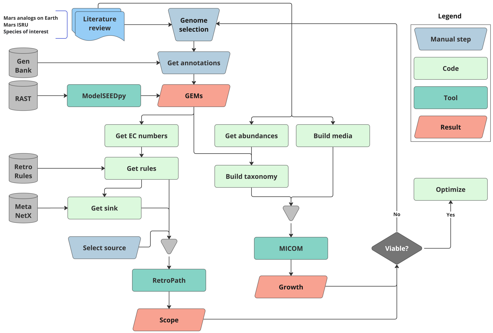

# Mars Biofoundry

This repo contains a functional pipeline for analysing microbial communities in Mars analogs.
Currently, it supports the data from [Amils et al. 2023](https://doi.org/10.1111/1462-2920.16291) for Río Tinto, an extreme environment on Spain.

This is the flowchart followed for the pipeline:

## Quickstart

Information of the pipeline steps can be found in the [notebooks folder](notebooks/):

* Preprocessing of supplementary data from [Amils et al. 2023](https://doi.org/10.1111/1462-2920.16291): [00-Data.ipynb](notebooks/00-Data.ipynb)

* Creation of genome-scale metabolic models (GEMs) using [ModelSEEDpy](https://github.com/ModelSEED/ModelSEEDpy): [01-GEM.ipynb](notebooks/01-GEM.ipynb)

* Assessment of metabolic capabilities using [RetroPath2.0](https://doi.org/10.1016/j.ymben.2017.12.002): [02-RetroPath.ipynb](notebooks/02-RetroPath.ipynb)

* Community analysis using [MICOM](https://doi.org/10.1128/msystems.00606-19): [03-MICOM.ipynb](notebooks/03-MICOM.ipynb)

## Installation

Please, refer to the [installation manual](INSTALL.md).

## Future work

* Better logging
* Dockerfile
* Unit tests
* CD/CI with GitHub Actions
